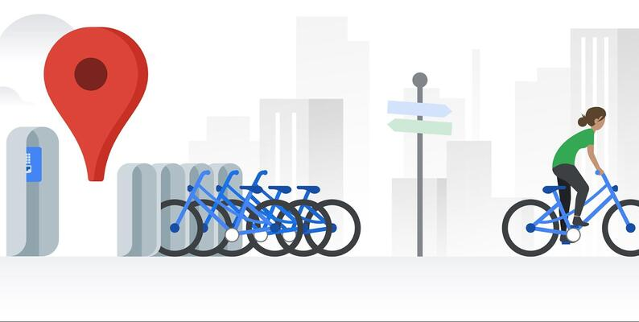

# Data Science Portfolio

### Bank Case Study(Should you get the loan? Will you pay the loan on time?)

This case study aims to identify patterns which indicate if a client has difficulty paying
their installments which may be used for taking actions such as denying the loan,
reducing the amount of loan, lending (to risky applicants) at a higher interest rate, etc.
This will ensure that the consumers capable of repaying the loan are not rejected.
Identification of such applicants using EDA is the aim of this case study.

### RSVP Movies Case Study

RSVP Movies is an Indian film production company which has produced many super-hit
movies. The production company wants to plan their every move analytically based on
data. Use SQL to Analyze the data and give recommendations to RSVP Movies based on
the insights. The entire analytics process has been divided into four segments, where
each segment leads to significant insights from different combinations of tables.

### Prediction of demand for shared bikes

To build a multiple linear regression model for the prediction of demand for shared
bikes with the available independent variables. It will be used by the management to
understand how exactly the demands vary with different features. They can accordingly
manipulate the business strategy to meet the demand levels and meet the customer's
expectations. Further, the model will be a good way for management to understand the
demand dynamics of a new market.

